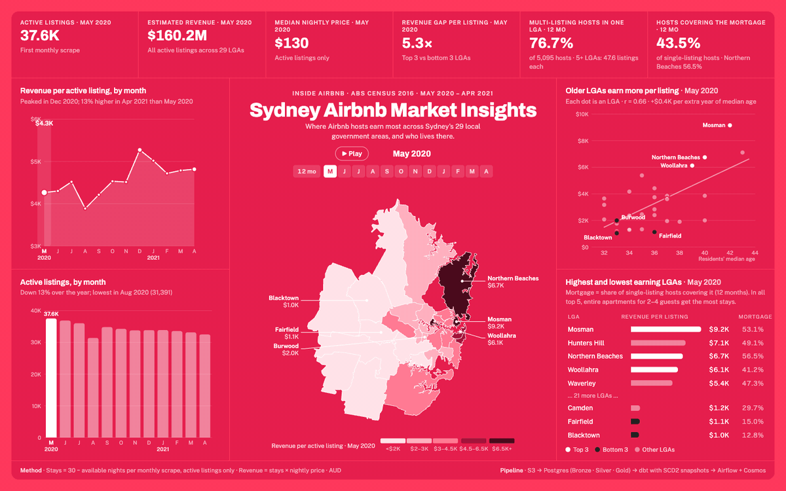
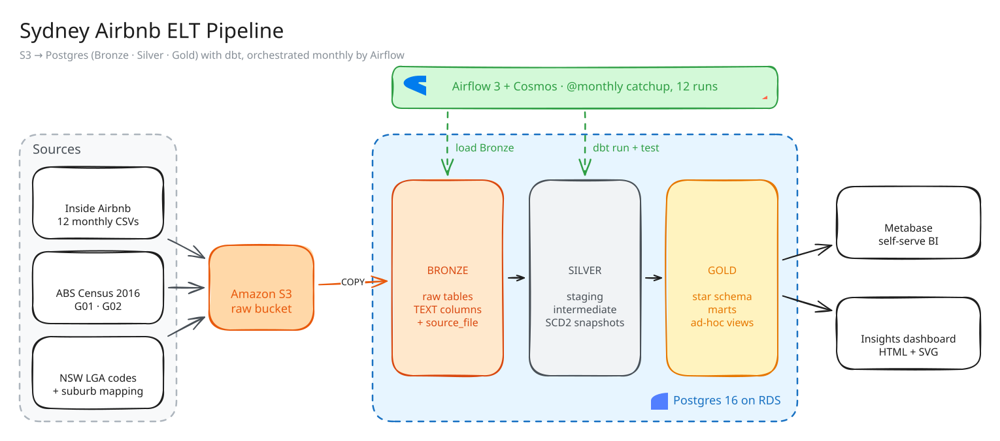

# Sydney Airbnb ELT Pipeline

An end-to-end ELT pipeline that turns 12 months of [Inside Airbnb](https://insideairbnb.com/get-the-data/) Sydney listings (May 2020 – Apr 2021) and the ABS 2016 Census into a dimensional model, with full change history, orchestrated month by month in Airflow.



**[Open the interactive dashboard →](https://claude.ai/artifact/2jfppXB5xY59izFuinFdyY)**

## Highlights

- **Medallion architecture on Postgres:** raw CSVs land in Bronze, dbt cleans and models them in Silver, and Gold serves a star schema, marts and analysis views.
- **SCD Type 2 history with dbt snapshots:** hosts, properties, LGAs and suburbs keep every version. Facts join to the version that was valid in their month, so a host who became a Superhost in August is reported correctly for both May and August.
- **Airflow backfill, one month per run:** `catchup=True` with `max_active_runs=1` replays the 12 months in order, which is what lets the snapshots build real history. Loading everything at once would have captured only the final state.
- **dbt inside Airflow through Astronomer Cosmos:** every dbt model, snapshot and test is its own Airflow task, with retries and lineage.
- **Idempotent loads:** each listings file is loaded once (tracked by `source_file`), and reference tables are reloaded with `TRUNCATE` plus `COPY` in a single transaction. Any run can be retried safely.
- **Verified end to end:** row counts reconcile at every layer (CSV = Bronze = Staging = Fact, 412,122 rows), every fact row matches exactly one dimension version, and all dbt tests pass.

## Architecture



<sub>Source: [`docs/architecture.excalidraw`](docs/architecture.excalidraw). Open it at excalidraw.com to edit.</sub>

| Layer | Tool | What it does |
|---|---|---|
| Storage | AWS S3 | Raw CSVs, partitioned by source (`listings/`, `census/`, `suburb/`) |
| Warehouse | Postgres 16 on AWS RDS | `bronze`, `silver` and `gold` schemas |
| Ingestion | Python, boto3, psycopg2 | Streams files from S3 into Bronze with `COPY` |
| Transformation | dbt-core 1.12, dbt-postgres | Staging, intermediate models, snapshots, star schema, marts, tests |
| Orchestration | Apache Airflow 3.3 in Docker, Astronomer Cosmos | One run per month: load Bronze, then the whole dbt graph |
| BI | Metabase, custom HTML/SVG dashboard | Self-serve exploration and the presentation dashboard |

## Data model

### Bronze (`bronze` schema)
Raw copies of the sources, every column stored as `TEXT` so a malformed value never fails a load: `listings` (plus `source_file`), `census_g01`, `census_g02`, `lga_codes`, `suburb_lga_mapping`.

### Silver (`silver` schema)
- **Staging** (`stg_*`): one model per source. Casts types, converts `t`/`f` to booleans, blanks to `NULL`, and strips the `LGA` prefix from census codes. `stg_listings` derives `listing_month` from the file name and corrects scrape dates that fall outside their file's month.
- **Intermediate** (`int_host`, `int_property`, `int_lga`, `int_suburb`): splits the wide listings table into entities, keeping the latest row per key, and resolves each host's suburb to an LGA.
- **Snapshots** (`*_snapshot`): dbt snapshots with the `timestamp` strategy on `scraped_at`, producing SCD Type 2 history.

### Gold (`gold` schema)

| Folder | Models | Purpose |
|---|---|---|
| `star/` | `dim_host`, `dim_property`, `dim_lga`, `dim_suburb`, `fact_listings`, `ref_census_g01`, `ref_census_g02` | Star schema. Dimensions carry `valid_from` / `valid_to` truncated to the month; the fact holds one row per listing per month. |
| `mart/` | `mart_listing_neighbourhood`, `mart_property_type`, `mart_host_neighbourhood` | Monthly KPIs: active rate, prices, Superhost rate, stays, revenue, month-on-month change |
| `adhoc/` | `adhoc_lga_demographics`, `adhoc_median_age_vs_revenue`, `adhoc_best_listing_type`, `adhoc_host_lga_spread`, `adhoc_mortgage_coverage` | One view per business question, feeding the dashboards |

**How facts join to history:**
```sql
join dim_host h
  on f.host_id = h.host_id
 and f.listing_month >= h.valid_from
 and (h.valid_to is null or f.listing_month < h.valid_to)
```

**Metric definitions:** stays = 30 − `availability_30` for active listings; estimated revenue = stays × nightly price (AUD).

## Orchestration

`airflow/dags/airbnb_etl_dag.py` runs `@monthly` from 2020-05-01 to 2021-04-01:

```
load_reference ─┐
                ├─► dbt_transform (Cosmos task group: run + test per model, snapshots in dependency order)
load_listings ──┘
```

- `load_listings` loads only the run's own file, `listings/{MM_YYYY}.csv`, taken from the run's logical date.
- dbt runs in its own virtualenv inside a custom Airflow image, so its dependencies never conflict with Airflow's.
- The stack runs on the LocalExecutor (Postgres metadata DB, API server, scheduler, DAG processor), which suits a single machine. AWS credentials are mounted read-only from `~/.aws`.

## Findings

From the 12 months of data:

1. **The top 3 LGAs earn 6.5× more per listing than the bottom 3** ($73.1K vs $11.2K a year). Mosman, Northern Beaches and Woollahra lead; Burwood, Blacktown and Fairfield trail.
2. **Revenue rises with residents' median age (r = 0.65).** The top LGAs are older (median age 40 vs 34), wealthier ($2,462 vs $1,501 household income a week) and have smaller households.
3. **Entire apartments for 2–4 guests are the most-booked listing type** in all five top-earning LGAs, at about 182 booked nights a year each.
4. **76.7% of multi-listing hosts operate in a single LGA.** Hosts spread across 5 or more LGAs are professional operators, averaging 47.6 listings each.
5. **43.5% of single-listing hosts earn enough to cover their LGA's median mortgage**, from 56.5% in Northern Beaches down to 12.8% in Blacktown.
6. **Through COVID, active listings fell 13%** (37.6K to 32.5K), while revenue per active listing peaked in December 2020 at $5.3K a month.

## Data quality

- **dbt tests:** `unique` and `not_null` on every key, `accepted_values` on room type, and a composite uniqueness test on the fact grain (`listing_id`, `listing_month`).
- **Reconciliation:** row counts match for all 12 months across the CSV files, Bronze, staging and the fact table, with no duplicate listings per file.
- **SCD2 integrity:** 0 fact rows without a matching dimension version, and 1,576 Superhost status changes captured over the year.
- **Known data issues, handled:** some scrape dates fall outside their file's month and are corrected to the file month (flagged with `is_scraped_date_corrected`). Some listings have a price of 0; they are kept and documented rather than silently dropped.

## Project structure

```
├── airflow/
│   ├── dags/airbnb_etl_dag.py   # monthly DAG: Bronze loads + Cosmos dbt task group
│   ├── Dockerfile               # Airflow 3.3 + Cosmos + isolated dbt venv
│   └── docker-compose.yaml      # LocalExecutor stack + Metabase
├── ingestion/                   # S3 → Bronze loaders (idempotent)
├── dbt/
│   ├── models/silver/           # staging + intermediate
│   ├── snapshots/               # SCD2 snapshots
│   └── models/gold/             # star, mart, adhoc
├── dashboard/                   # insights dashboard: template, build script, LGA boundaries
├── data/                        # source CSVs
└── docs/                        # dashboard GIF, screenshot, architecture diagram
```

## Running it

**Prerequisites:** Docker, Python 3.12+ with [uv](https://docs.astral.sh/uv/), an S3 bucket, a Postgres database (RDS or local), and AWS credentials in `~/.aws`.

1. **Get the data.** Download the Sydney listings for May 2020–April 2021 from the Inside Airbnb archive and save the CSVs in `data/listings/`, named `05_2020.csv` through `04_2021.csv`. Download the ABS 2016 Census General Community Profile G01 and G02 CSVs for NSW LGAs and save them in `data/census/` as `2016Census_G01_NSW_LGA.csv` and `2016Census_G02_NSW_LGA.csv`.

2. **Configure the environment.** Create `.env` in the project root:
   ```bash
   S3_BUCKET=your-bucket
   POSTGRES_HOST=your-host
   POSTGRES_DATABASE=airbnb
   POSTGRES_USER=your-user
   POSTGRES_PASSWORD=your-password
   ```
   Then copy `airflow/.env.example` to `airflow/.env` and fill in the Airflow keys.

3. **Upload the source files and create the Bronze tables.**
   ```bash
   uv sync
   aws s3 cp data/ s3://your-bucket/ --recursive
   uv run python -m ingestion.create_tables   # one-time setup: drops and recreates the bronze schema
   ```

4. **Start Airflow and Metabase.**
   ```bash
   cd airflow
   docker compose build
   docker compose up -d
   ```
   Airflow is at http://localhost:8080 and Metabase at http://localhost:3000.

5. **Run the pipeline.** Unpause `airbnb_etl` in the Airflow UI. It backfills all 12 months in order, about 1–2 minutes per month.

6. **Rebuild the dashboard** after a dbt run:
   ```bash
   uv run python -m dashboard.build
   ```

## Design decisions

- **Snapshots run once per month, in order.** SCD2 only records what it sees when it runs, so the backfill replays history the way it would have arrived.
- **Validity is truncated to the month.** Listings are scraped monthly, so a version is valid for whole months. Exact scrape dates left 16% of facts (6,032 of 37,562 in May) dated before their host's version started.
- **Every Bronze column is `TEXT`.** Loading never fails on bad values; typing and cleaning happen in staging, where they're tested.
- **dbt runs in its own virtualenv.** Airflow and dbt pin conflicting libraries, so isolating dbt is the setup Cosmos recommends.

## Future improvements

- Switch snapshots to the `check` strategy on business columns, so a new version is created only when an attribute actually changes, not every month.
- Add a reconciliation test (Bronze vs fact row counts) to the dbt suite, so drift fails the run automatically.
- Make Gold models incremental as data volume grows.

## Data sources

- Inside Airbnb, Sydney listings, May 2020 – April 2021
- Australian Bureau of Statistics, 2016 Census General Community Profile (G01, G02) by LGA
- Australian Bureau of Statistics, ASGS 2016 LGA boundaries (simplified, for the map)
